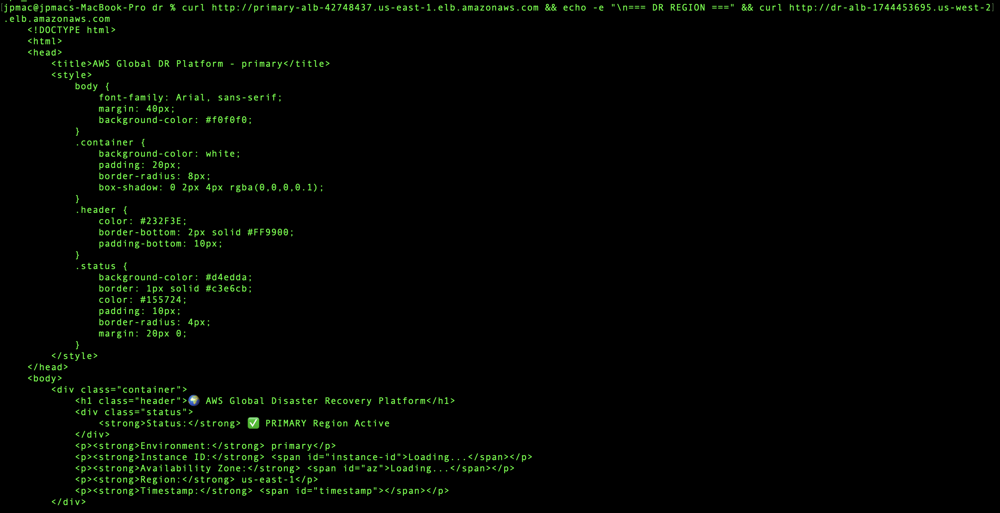
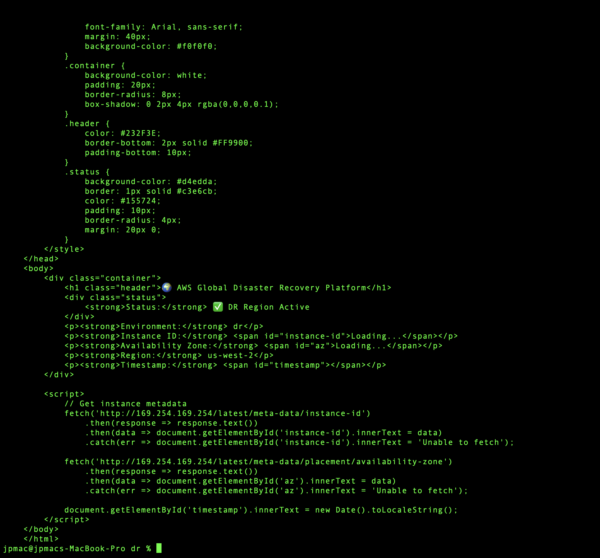
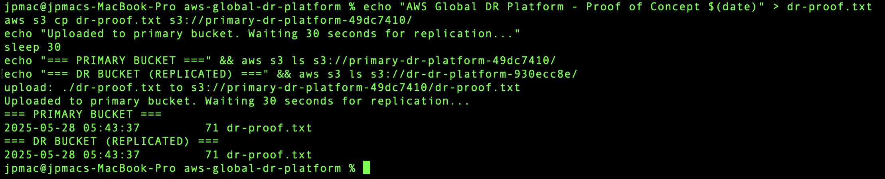
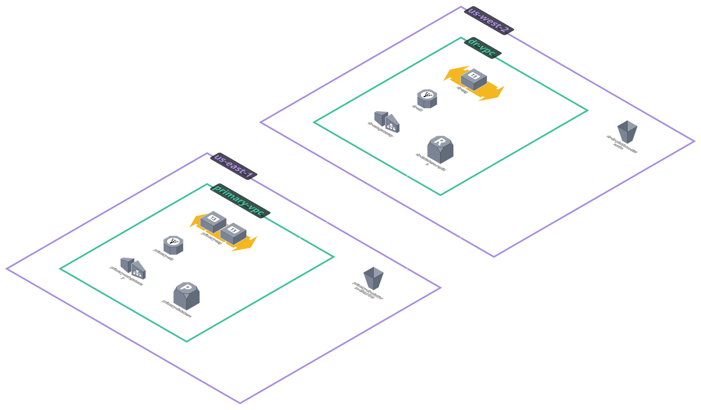

# 🌍 AWS Global Disaster Recovery Platform


🔗 **Not Live:** Infrastructure successfully deployed and tested, then decommissioned to avoid AWS charges. See [technical evidence](docs/evidence/) for deployment proof.

## 📋 Project Overview

This project implements an enterprise-grade AWS Global Disaster Recovery Platform using Infrastructure as Code (Terraform). The solution demonstrates all five AWS Well-Architected Framework pillars through a realistic multi-region disaster recovery scenario with automated database replication, storage synchronization, and cross-region failover capabilities.

The platform showcases advanced cloud architecture patterns including encrypted cross-region RDS read replicas, S3 cross-region replication, multi-AZ deployment strategies, and Infrastructure as Code best practices using modular Terraform design.

**Primary Region:** us-east-1 (N. Virginia)  
**DR Region:** us-west-2 (Oregon)

---

## ✅ Key Features & Services

- 🏗️ **Terraform** - Infrastructure as Code with modular design
- 🌍 **Multi-Region Architecture** - Active-passive disaster recovery setup
- 🗄️ **Amazon RDS** - Multi-AZ primary with encrypted cross-region read replica
- 📦 **Amazon S3** - Cross-region replication with lifecycle policies
- ⚖️ **Application Load Balancer** - Health checks and traffic distribution
- 🔧 **Auto Scaling Groups** - Dynamic capacity management across regions
- 🔐 **VPC & Security Groups** - Network isolation and security controls
- 📊 **CloudWatch** - Monitoring and logging integration

---

## 🖥️ Application in Action





The screenshots above demonstrate successful multi-region deployment with both primary (us-east-1) and DR (us-west-2) regions serving traffic, plus automated S3 cross-region replication working in real-time.

---

## 🗺️ Architecture Overview



The architecture follows AWS disaster recovery best practices, implementing an active-passive multi-region setup with automated data replication, encrypted storage, and identical infrastructure across regions for seamless failover capabilities.

## 🔄 How Disaster Recovery Works

### Disaster Recovery Flow

**Normal Operations (Primary Region Active):**
1. **User Traffic** → Direct connection to Primary ALB (us-east-1)
2. **Load Balancing** → ALB distributes requests across 2 EC2 instances
3. **Data Writes** → Applications write to RDS Multi-AZ primary database
4. **File Storage** → Applications store files in primary S3 bucket
5. **Replication** → RDS automatically replicates to DR region read replica
6. **S3 Sync** → S3 automatically replicates objects to DR bucket

**Disaster Scenario (Primary Region Failure):**
1. **Failure Detection** → Primary ALB becomes unreachable
2. **Traffic Rerouting** → Applications/users redirect to DR ALB (us-west-2)
3. **Database Promotion** → RDS read replica can be promoted to standalone database
4. **Application Recovery** → DR Auto Scaling Group scales up to handle full load
5. **Data Access** → Applications access replicated data in DR S3 bucket

**Recovery Infrastructure:**
- **Standby Capacity**: DR region maintains minimal running infrastructure
- **Data Synchronization**: Continuous replication ensures data availability
- **Independent Operation**: DR region can operate independently when needed

---

## 🌊 Data Flow Architecture

### Request Processing Flow

**1. User Request Journey:**
```
Internet User → Regional ALB → Auto Scaling Group → EC2 Instances
```

**2. Database Operations:**
```
Primary Region: App → RDS Multi-AZ → Cross-Region Replication → DR Read Replica
DR Region: App → RDS Read Replica (promoted when needed)
```

**3. File Storage Operations:**
```
Primary: App → S3 Primary Bucket → Cross-Region Replication → S3 DR Bucket
DR: App → S3 DR Bucket (direct access when needed)
```

### Cross-Region Synchronization

**Database Replication:**
- **Method**: MySQL binary log replication
- **Frequency**: Real-time asynchronous replication
- **Encryption**: KMS encryption with cross-region keys
- **Lag**: Typically <1 second under normal conditions

**S3 Cross-Region Replication:**
- **Trigger**: Object creation/modification in primary bucket
- **Speed**: Usually completes within 15 minutes
- **Scope**: All objects automatically replicated
- **Versioning**: Maintains object versions across regions

**Network Communication:**
- **Cross-Region**: Services communicate over AWS backbone network
- **Security**: All cross-region traffic encrypted in transit
- **Isolation**: Each region operates in separate VPCs (10.0.0.0/16 vs 10.1.0.0/16)

### Infrastructure Capabilities

**High Availability Features:**
1. **Multi-AZ Deployment**: Primary region uses multiple availability zones
2. **Auto Scaling**: Automatic instance replacement and scaling
3. **Load Balancing**: Health checks and traffic distribution
4. **Database Redundancy**: Multi-AZ primary with cross-region replica

**Disaster Recovery Readiness:**
1. **Standby Infrastructure**: DR region maintains running load balancer and minimal capacity
2. **Data Replication**: Continuous database and storage synchronization
3. **Independent Networking**: Separate VPC allows isolated operation
4. **Scalable Capacity**: Auto Scaling Groups can increase capacity when needed

---

```
aws-global-dr-platform/
├── terraform/                    # Infrastructure as Code
│   ├── environments/
│   │   ├── primary/             # us-east-1 configuration
│   │   │   ├── main.tf          # Primary region resources
│   │   │   ├── variables.tf     # Primary region variables
│   │   │   └── outputs.tf       # Primary region outputs
│   │   └── dr/                  # us-west-2 configuration
│   │       ├── main.tf          # DR region resources
│   │       ├── variables.tf     # DR region variables
│   │       └── outputs.tf       # DR region outputs
│   └── modules/                 # Reusable Terraform modules
│       ├── networking/          # VPC, subnets, security groups
│       ├── compute/             # ALB, ASG, launch templates
│       ├── database/            # RDS primary and replica
│       └── storage/             # S3 buckets and replication
├── scripts/                     # Deployment automation
│   ├── deploy.sh               # Automated deployment script
│   └── destroy.sh              # Safe cleanup script
├── architecture/                # Architecture diagrams
├── docs/                       # Additional documentation
│   └── evidence/               # Deployment proof screenshots
└── README.md                   # Project documentation
```

---

## 🚀 Deployment Process

### Prerequisites
- AWS CLI configured with appropriate permissions
- Terraform v1.5+ installed
- Sufficient AWS permissions for multi-region deployment

### Step 1: Clone and Initialize
```bash
git clone https://github.com/jimmyperalta-dev/aws-global-dr-platform.git
cd aws-global-dr-platform
```

### Step 2: Deploy Infrastructure
```bash
# Make scripts executable
chmod +x scripts/*.sh

# Deploy both regions
./scripts/deploy.sh
# Select Option 3: Deploy Both Regions
```

### Step 3: Enable Cross-Region Replication
```bash
./scripts/deploy.sh
# Select Option 4: Setup S3 Cross-Region Replication
```

### Step 4: Test Deployment
```bash
# Test primary region
curl http://primary-alb-dns-name.us-east-1.elb.amazonaws.com

# Test DR region  
curl http://dr-alb-dns-name.us-west-2.elb.amazonaws.com
```

---

## 🧠 Skills Demonstrated

- **Infrastructure as Code** - Advanced Terraform with modular design patterns
- **Multi-Region Architecture** - Cross-region disaster recovery implementation
- **Database Management** - RDS Multi-AZ with encrypted cross-region replicas
- **Storage Replication** - S3 cross-region replication with lifecycle policies
- **Network Security** - VPC design, security groups, and isolation strategies
- **Auto Scaling** - Dynamic capacity management across multiple regions
- **DevOps Automation** - Deployment scripts with error handling and validation
- **Cost Optimization** - Right-sized resources and efficient architecture design
- **Security Best Practices** - Encryption at rest and in transit, IAM least privilege
- **AWS Well-Architected Framework** - All five pillars implemented

---

## 📝 Lessons Learned

- **Cross-Region Challenges**: Resolved encryption compatibility issues between RDS regions requiring specific KMS key configurations for cross-region read replicas
- **Terraform State Management**: Implemented proper state handling for complex multi-environment deployments with dependency management
- **VPC Security Groups**: Handled cross-region security group dependencies by using proper subnet groups for database replicas
- **S3 Replication IAM**: Configured complex IAM roles and policies for secure cross-region S3 replication
- **Cost Optimization**: Balanced high availability requirements with cost-effective resource sizing using t3.micro instances and single NAT gateway strategy

---

## 📚 Additional Resources

- [AWS Disaster Recovery Whitepaper](https://docs.aws.amazon.com/whitepapers/latest/disaster-recovery-workloads-on-aws/disaster-recovery-workloads-on-aws.html)
- [Terraform AWS Provider Documentation](https://registry.terraform.io/providers/hashicorp/aws/latest/docs)
- [AWS Well-Architected Framework](https://aws.amazon.com/architecture/well-architected/)
- [RDS Cross-Region Read Replicas](https://docs.aws.amazon.com/AmazonRDS/latest/UserGuide/USER_ReadRepl.XRgn.html)

---

## 🔗 Related Projects

- [Serverless REST API with DynamoDB](https://github.com/jimmyperalta-dev/aws-serverless-dynamodb-api)
- [Containerized Application on AWS ECS Fargate](https://github.com/jimmyperalta-dev/aws-ecs-fargate-application)
- [CI/CD Pipeline with AWS CodePipeline](https://github.com/jimmyperalta-dev/aws-cicd-pipeline-infrastructure)
- [Static Website Deployment on AWS](https://github.com/jimmyperalta-dev/aws-ec2-s3-route53-webapp)

---

## </> Development Notes

This project was developed with assistance from Claude to enhance code quality and documentation standards. All implementations were thoroughly tested and validated by me, with comprehensive evidence provided of successful deployment and functionality.

---

## 👤 Author

**Jimmy Peralta**  
🛠️ Associate Media Systems Engineer | ☁️ AWS Cloud Enthusiast  
🌐 [https://www.deployjimmy.com](https://www.deployjimmy.com)
